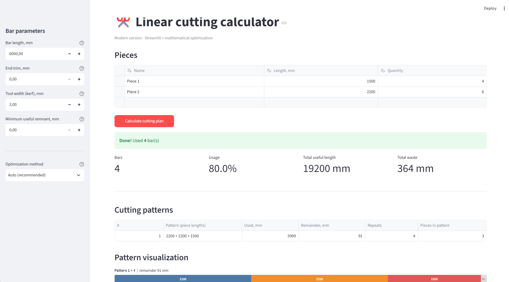

# Linear Cutting Calculator (Streamlit)

Modern replacement for the old Excel linear cutting stock calculator (version Bakanov 1.03).
Available in three languages: **English**, **Russian**, **Polish**.

The app optimizes the 1D cutting stock problem: given standard bar lengths and
a list of required pieces, it finds a cutting plan that uses the fewest bars,
taking into account end trimming and the tool kerf.

## Language versions

| File      | Language | UI |
|-----------|----------|-----|
| `app.py`  | English  | English |
| `app_ru.py` | Russian | Русский |
| `app_pl.py` | Polish  | Polski |

## Features

- Accounts for **end trimming** and **tool width (kerf)**
- Optimizes the number of bars (ILP + heuristic)
- Visual bar cutting diagrams
- Export results to CSV + printable text report
- Inline data editor for pieces (add/remove rows)
- Works fully offline

## Installation

```bash
install.bat
```

The script creates a virtual environment in `.venv`, upgrades pip
and installs all dependencies from `requirements.txt`.

## Usage

| Script        | Language | App file |
|---------------|----------|----------|
| `start.bat`   | English  | `app.py` |
| `start_ru.bat`| Russian  | `app_ru.py` |
| `start_pl.bat`| Polish   | `app_pl.py` |

Double-click the desired script, or run manually:

```bash
.\.venv\Scripts\streamlit run app.py        # English
.\.venv\Scripts\streamlit run app_ru.py     # Russian
.\.venv\Scripts\streamlit run app_pl.py     # Polish
```

## Parameters

| Parameter | Description |
|-----------|-------------|
| Bar length | Standard profile length |
| End trim | Cut from the end of the bar |
| Tool width | Kerf — added to each piece |
| Minimum useful remnant | Informational only |

## Optimization methods

- **Auto** — chooses ILP or fast FFD depending on task size
- **ILP** — mathematical optimization (pattern generation + ILP, PuLP/CBC), close to optimal
- **First Fit Decreasing** — very fast heuristic algorithm

The solver falls back to FFD automatically if ILP cannot find a solution in time.

## Dependencies

| Package | Purpose |
|---------|---------|
| `streamlit` | Web UI |
| `pandas` / `numpy` | Data handling |
| `pulp` | ILP solver (CBC) |
| `ortools` | Optional LP backend (auto-detected at import) |

## Project structure

```
app.py        # English version (main)
app_ru.py     # Russian version
app_pl.py     # Polish version
install.bat   # Creates .venv and installs requirements
start*.bat    # Launch scripts for each language
requirements.txt
```

All three versions share the same optimization core; only the UI text differs.

---

Version 1.0

## Demo

[Cutting Calculator](https://olegushakov-pl-linear-cut-streamlit-app-j0ah4s.streamlit.app/)
